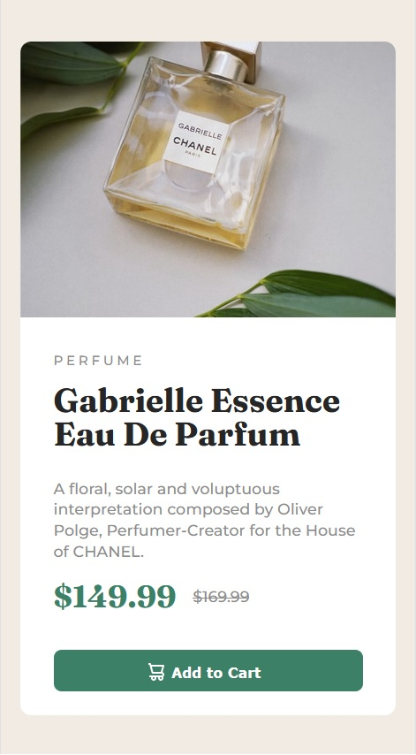

# Frontend Mentor - Product preview card component solution

This is a solution to the [Product preview card component challenge on Frontend Mentor](https://www.frontendmentor.io/challenges/product-preview-card-component-GO7UmttRfa). Frontend Mentor challenges help you improve your coding skills by building realistic projects. 

## Table of contents

- [Overview](#overview)
  - [The challenge](#the-challenge)
  - [Screenshot](#screenshot)
  - [Links](#links)
- [My process](#my-process)
  - [Built with](#built-with)
  - [What I learned](#what-i-learned)
  - [Continued development](#continued-development)
  - [Useful resources](#useful-resources)
- [Author](#author)

## Overview

### The challenge

Users should be able to:

- View the optimal layout depending on their device's screen size
- See hover and focus states for interactive elements

### Screenshot

### Links

- Solution URL: [Solution](https://github.com/smthom/product-preview-card-component)
- Live Site URL: [Live Site](https://smthom.github.io/product-preview-card-component/index.html)

## My process

### Built with

- Notepad++
- Semantic HTML5 markup
- CSS custom properties
- CSS Grid
- Desktop-first workflow

### What I learned

This was mostly revision from what I have previously learned. Just before the challenge however I did spend a little time on using SVGs as I struggled for a time to manipulate them such as changing the colours etc. Due to that learning
applying the SVG to the button proved to be a quick process. I'm please to see that in compeleting projects some processes I'm going through are starting to get a little faster.

### Continued development

I've been pulled away from learning Web development due to life commitments. This is the first project I've done in a while. It was fun to finish it quite quickly, just in one evening after the child has gone to bed.

My aim for the time being is to try more challenges from Frontend Mentor.

### Useful resources

- [W3 Schools](https://www.w3schools.com/css/default.asp) - I find this a useful reference to remind of how CSS works. Its quick to find subjects on it.

## Author

- Frontend Mentor - [@smthom](https://www.frontendmentor.io/profile/smthom)
